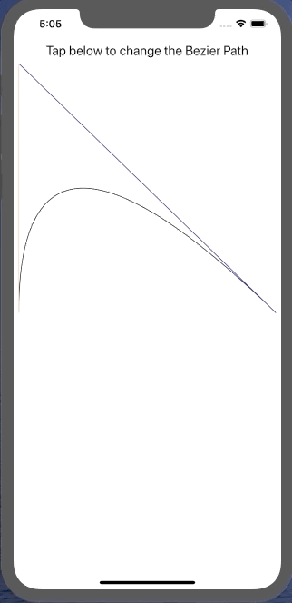

# Pursuit-Core-iOS-Bezier-Path-Lab

Build an app that draws a curve from one end of the screen to the other.  Tapping on the screen should change the control point.  Bonus: add a pan gesture recognizer that allows the user to drag the control point around.

